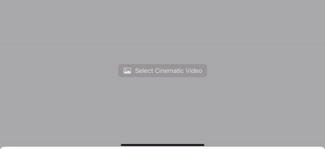

# cinematic-mode-video-viewer

cinematic-mode-video-viewer is an iOS application that displays Apple's Cinematic Mode videos.  
The app dynamically distorts the video based on the captured depth.

## Features

- Display Apple's Cinematic Mode videos.
- Dynamic distortion of the video based on captured depth.
- Supports iOS 17 and Xcode 15 or later.
- Compatible with iPhone and iPad devices (physical devices only).

## Screenshots

## Implementation Details

### Technology Stack

- **RealityKit in non-AR Mode:** Utilizes RealityKit in non-AR mode for video rendering.
- **Mesh Creation:** Generates a mesh consisting of 320 columns and 180 rows (depth image resolution).
- **Texture Mapping:** Applies the video frames to the created mesh.
- **Custom Material:** Implements custom materials to modify coordinates based on the depth of the depth image.  
  Utilizes the geometry modifier to dynamically move coordinates based on the depth, employing a technique commonly known as **vertex texture fetch**.

## Requirements

- iOS 17 or later.
- Xcode 15 or later.

## Usage

1. Clone the repository.
2. Open the Xcode project file.
3. Build and run the app on a physical iPhone or iPad device.
